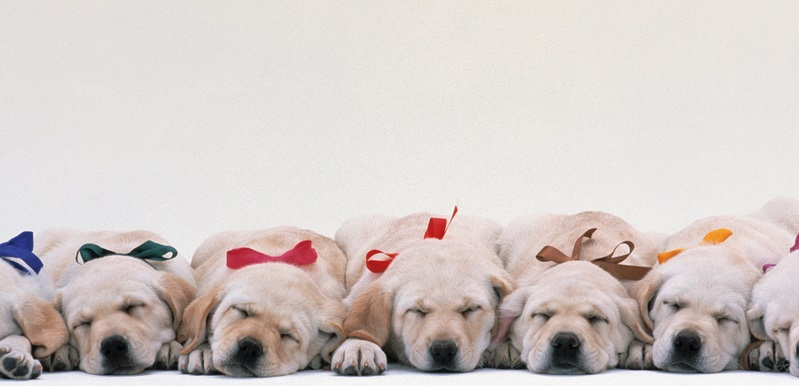
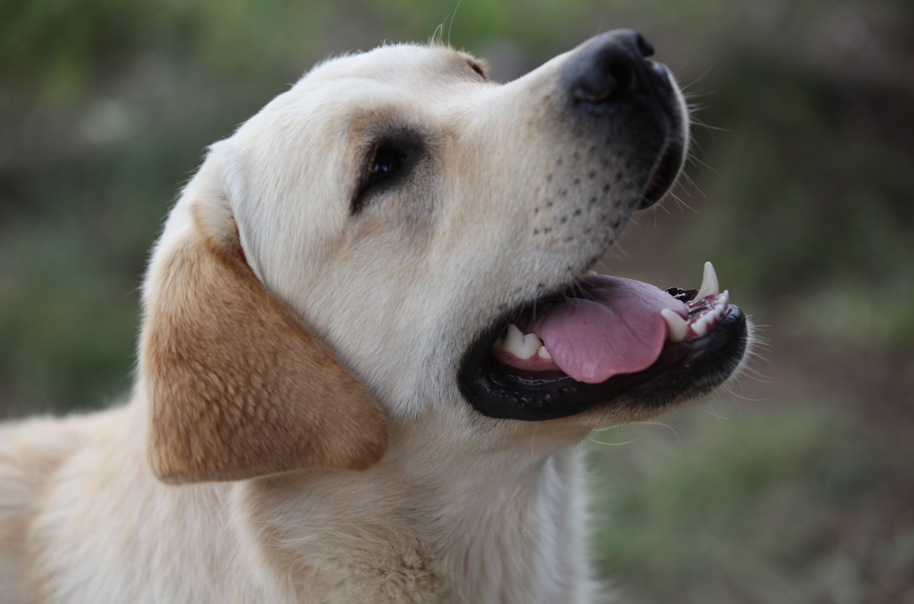
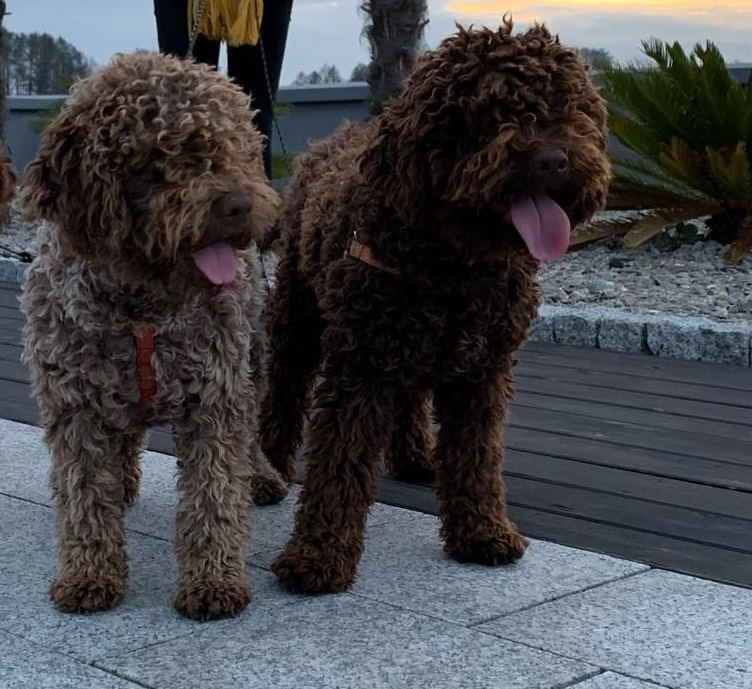

<!-- Main -->

<!-- One -->
<section id="one">
	

		<header class="major">
			<h2>O nas</h2>
		</header>
		

	

</section>

<!-- Two -->
<section id="two" class="spotlights">
	<section>
		
		

			

				<header class="major">
					<h3>Nasze Szczenięta</h3>
				</header>
				

				<ul class="actions">
					<li><a href="nasze_szczenieta.html" class="button">Kliknij</a></li>
				</ul>
			

		

	</section>
	<section>
		
		

			

				<header class="major">
					<h3>Nasze Labradory</h3>
				</header>
				

				<ul class="actions">
					<li><a href="nasze_labradory.html" class="button">Kliknij</a></li>
				</ul>
			

		

	</section>
	<section>
		
		

			

				<header class="major">
					<h3>Nasze Lagotto</h3>
				</header>
				

				<ul class="actions">
					<li><a href="nasze_lagotto.html" class="button">Kliknij</a></li>
				</ul>
			

		

	</section>
</section>

