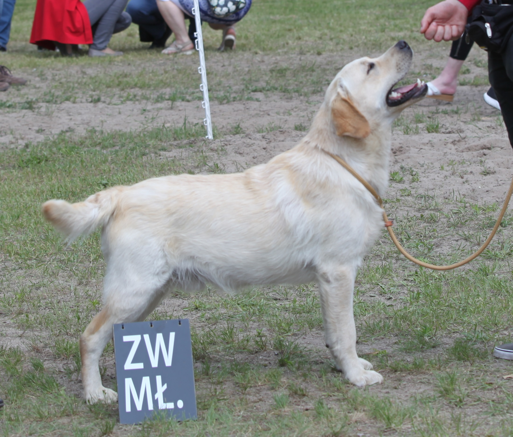
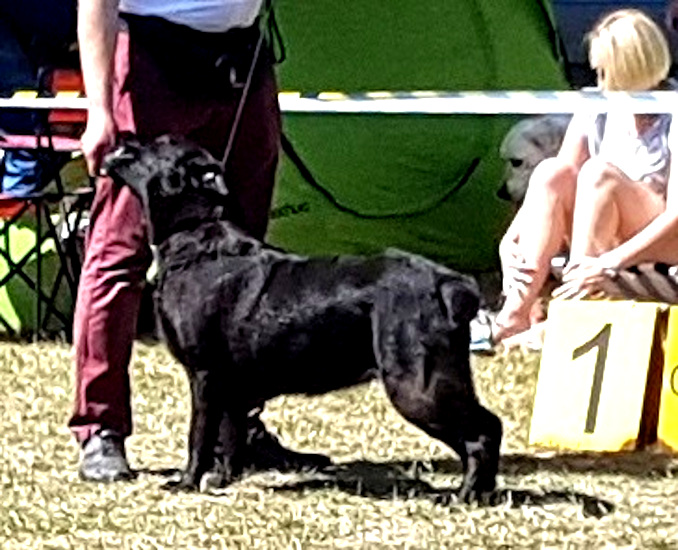

<!-- Main -->

<!-- Two -->
<!-- Three -->
<section id="three">
	

		<header class="major">
			<h2>PSY</h2>
		</header>
	

</section>
<section id="two" class="spotlights">
	<section>
		<section class="image">
			
		</section>
		

			

				<header class="major">
					<h3>BARNI Tęczowy Gaj</h3>
				</header>
				
Ur. 25 marca 2018

			

		

	</section>
</section>
<section id="three">
	

		<header class="major">
			<h2>SUCZKI</h2>
		</header>
	

</section>
<section id="four" class="spotlights">
	<section>
			

		

			

				<header class="major">
					<h3>TOSCA TOSARI Tęczowy Gaj</h3>
				</header>
				
Ur. 5 marca 2017

			

		

	</section>
	<section>
			
		

			

				

				<header class="major">
					<h3>JASMINE Leśna Czereda</h3>
				</header>
				
Ur. 19 lutego 2017

				

			

		

	</section>
	<section>
			

		

			

				<header class="major">
					<h3>SHILOH SWEET Tęczowy Gaj</h3>
				</header>
				
Ur. 6 marca 2017

			

		

	</section>
	<section>
			
		

			

				

				<header class="major">
					<h3>INFRA Dolcecca Negra</h3>
				</header>
				
Ur. 29 stycznia 2018

				

			

		

	</section>
</section>
