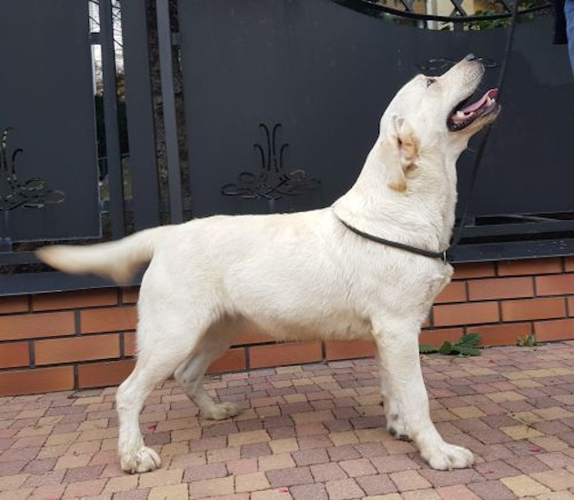

<!-- Main -->

<!-- One -->
<!--<section id="one">
	

		<header class="major">
			<h2>Suki</h2>
		</header>

Rodowody dostępne.

	

</section>-->
<!-- Two -->
<section id="four" class="spotlights">
	<section>
			

		

			

				<header class="major">
					<h3>TOSCA TOSARI Tęczowy Gaj</h3>
				</header>
				
Ur. 5 marca 2017

			

		

	</section>
	<section>
			
		

			

				

				<header class="major">
					<h3>JASMINE Leśna Czereda</h3>
				</header>
				
Ur. 19 lutego 2017

				

			

		

	</section>
	<section>
			

		

			

				<header class="major">
					<h3>SHILOH SWEET Tęczowy Gaj</h3>
				</header>
				
Ur. 6 marca 2017

			

		

	</section>
	<section>
			
		

			

				

				<header class="major">
					<h3>INFRA Dolcecca Negra</h3>
				</header>
				
Ur. 29 stycznia 2018

				

			

		

	</section>
</section>
